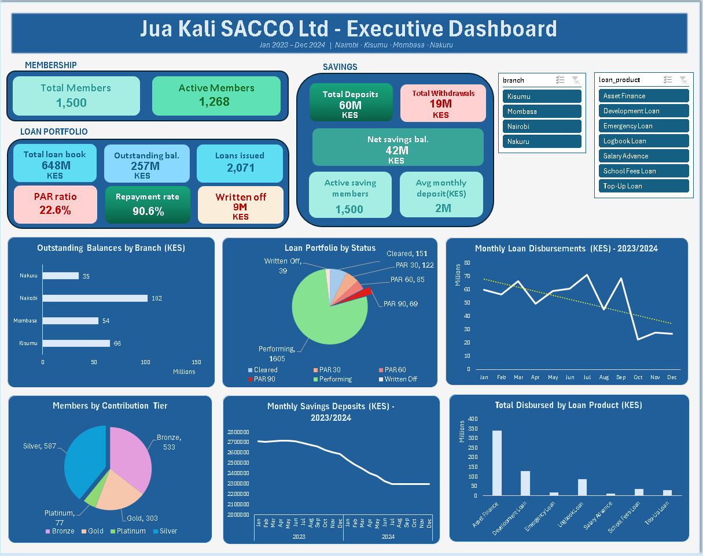

# Excel Loan & Savings Performance Dashboard — SACCO (Kenya)

---

## Executive Summary

**Business Problem:** Jua Kali SACCO Ltd, a mid-sized Kenyan savings cooperative with 1,500 members across 4 branches, lacked a consolidated reporting solution to monitor loan portfolio health, member savings growth, repayment performance, and flag at-risk accounts.

**Analytical Solution:** A fully dynamic Excel dashboard built on a Power Query and Power Pivot data model, integrating 4 data sources spanning 24 months of activity. The dashboard provides real-time filtering by branch and loan product.

**Key Findings:**
- Total loan book of **KES 648M** with an outstanding balance of **KES 257M**
- PAR ratio of **22.6%** — significantly above the SASRA-recommended threshold of 5%, signalling systemic credit risk
- Repayment rate of **90.6%** overall, masking branch-level divergence
- Asset Finance carries the highest outstanding balances and default concentration
- Nairobi branch accounts for ~45% of total disbursements but also drives the largest PAR exposure

**Recommended Next Steps:** Branch-level credit review for Nairobi, tightened collateral requirements for Asset Finance, and a member savings reactivation campaign targeting the 18% inactive member rate.

---

## Business Problem

Jua Kali SACCO Ltd operates across Nairobi, Kisumu, Mombasa, and Nakuru. Like most SACCOs regulated under Kenya's SASRA framework, management must track:

- Portfolio At Risk (PAR) — the primary regulatory metric
- Loan repayment performance across 7 distinct loan products
- Savings mobilisation trends and member contribution behaviour
- At-risk member accounts requiring follow-up

Without a centralised dashboard, the credit and finance teams were spending significant time manually compiling branch reports in separate workbooks with no consistent KPI definitions across offices.

**This project simulates a real analytics engagement** where a data analyst is brought in to design and automate the reporting workflow.

---

## Methodology

**Data Sources (synthetic, CSV):**
- `members_raw.csv` — 1,500 members with branch, occupation, contribution tier, status
- `loans_raw.csv` — 2,071 loan records across 7 products with disbursement, term, status, outstanding balance
- `savings_transactions.csv` — deposit and withdrawal transactions (Jan 2023 – Dec 2024)
- `repayment_schedule.csv` — installment-level repayment records with payment status and days late

**Process:**
1. Data loaded and cleaned in Power Query — date parsing, null handling, column typing, custom columns
2. Relationships built in Power Pivot with member_id as the primary key linking all tables
3. KPI measures written in DAX — PAR ratio, repayment rate, net savings, contribution tier
4. Dashboard built using Pivot Charts, slicers, and dynamic array formulas
5. Conditional formatting applied for at-risk member highlighting

**Analysis types:** KPI tracking, trend analysis, credit risk aging (PAR 30/60/90), member segmentation

---

## Skills & Tools Used

- **Power Query** — ETL pipeline loading and cleaning 4 CSV sources
- **Power Pivot** — relational data model with star schema (member_id as central key)
- **DAX measures** — PAR ratio, repayment rate, net savings, active members
- **Dynamic arrays** — FILTER, SORT, CHOOSE for the at-risk member register
- **XLOOKUP** — cross-table member name lookups
- **Conditional formatting** — colour-coded risk status on arrears register
- **Pivot Charts with slicers** — branch and loan product filters connected across all visuals
- **Data validation** — dropdown controls

---

## Dashboard



The dashboard provides a single-page executive view covering membership, loan portfolio health, savings performance, and key risk indicators. Branch and loan product slicers filter all visuals simultaneously.

For a deeper breakdown of individual loan records, the underlying data tables are available in the workbook's data sheets.

---

## Results & Business Recommendations

| KPI | Value |
|-----|-------|
| Total Members | 1,500 |
| Active Members | 1,268 |
| Total Loan Book | KES 648M |
| Outstanding Balance | KES 257M |
| Total Savings Mobilised | KES 60M |
| Portfolio At Risk (PAR) | **22.6%** ⚠️ |
| Repayment Rate | 90.6% |
| Total Loans Issued | 2,071 |

**Recommendations:**

1. **Urgent credit review — Nairobi branch:** Nairobi drives the largest loan book and PAR exposure. A targeted review of PAR 60+ accounts is recommended before further disbursements are approved.

2. **Tighten Asset Finance collateral policy:** Asset Finance loans carry the highest outstanding balances. Stricter collateral requirements would reduce recovery risk.

3. **Expand Salary Advance carefully:** These short-term loans show the highest repayment compliance and could be extended to more members to improve portfolio quality.

4. **Savings mobilisation gap:** Total savings cover approximately 23% of the outstanding loan portfolio — below SASRA's recommended ratio. A savings campaign targeting Kisumu and Nakuru branches is recommended.

5. **Inactive member reactivation:** 18% of members are inactive. A targeted contribution reminder programme could recover significant annual deposits.

---

## Next Steps

- Connect Power Query to a live SQL database for real-time refresh
- Build a Power BI companion report for executive presentations
- Add a loan forecasting tab using Excel's FORECAST.ETS function
- Extend the credit risk model with a member scoring index based on payment history, savings consistency, and tenure

---

## Folder Structure

```
sacco-loan-savings-dashboard/
│
├── data/
│   ├── members_raw.csv
│   ├── loans_raw.csv
│   ├── savings_transactions.csv
│   └── repayment_schedule.csv
│
├── excel/
│   └── sacco_dashboard_v1.xlsx
│
├── screenshots/
│   └── executive_dashboard.png
│
├── README.md
└── data_dictionary.md
```

---

*This is a simulated business case study. All data is synthetically generated and does not represent any real SACCO or individuals.*
